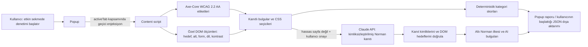

# UX & Erişilebilirlik Denetim Eklentisi

Bu Manifest V3 eklentisi, kullanıcının araç çubuğundan başlattığı açık sekmede yerel ve tekrarlanabilir kontroller çalıştırır. İsteğe bağlı Claude katmanı yalnızca kullanıcının her analizde ayrıca onayladığı, sınırlandırılmış yapısal gözlemleri değerlendirir. Kanıt kimliği olmayan AI bulgusu rapora alınmaz.

> Bu depo, doğrulanmış üç üretim sitesi raporu veya tamamlanmış manuel ekran okuyucu testi iddiasında bulunmaz. `/reports` altındaki dosyalar, gerçek denetimler yapılana kadar açıkça `NOT_RUN` durumundadır.

## Kurulum

1. Node.js 20+ ve npm kurun.
2. Bağımlılıkları ve kilit dosyasını doğrulayarak yükleyin:

   ```sh
   npm ci
   ```

   `axe-core` 4.14.0 yerel olarak dağıtılır; `content/AXE-LICENSE.txt` ve `content/AXE-THIRD-PARTY-LICENSES.txt` lisans bildirimlerini içerir.
3. Chrome'da `chrome://extensions` açın, Geliştirici modu'nu etkinleştirin ve **Paketlenmemiş öğe yükle** ile bu klasörü seçin.
4. Denetlenecek sekmede eklenti simgesine tıklayıp **Sayfayı denetle** düğmesini kullanın. İçerik betiği arka planda tüm sitelerde çalışmaz; sadece açık kullanıcı eylemiyle etkin sekmeye enjekte edilir.
5. AI isteğe bağlıdır. Anthropic Console'dan kendi API anahtarınızı alın, açılır penceredeki alana girip **Kaydet**'e basın. Anahtar kaynak kodda bulunmaz; bu tarayıcı profilinin `chrome.storage.local` alanında saklanır. Chrome profil depolamasının işletim sistemi seviyesinde bir gizli kasa olmadığını unutmayın; ortak/prod cihazda anahtarı saklamayın ve işiniz bitince silin.
6. AI kullanacaksanız paylaşım kutusunu işaretleyin. Eklenti, **her denetimde**, Claude'a gönderilecek sınırlı veriyi ve alıcıyı belirten ikinci bir onay ister. İptal durumunda yerel kontroller/skor çalışır.
7. AI kullanılmadan çalışan testler:

   ```sh
   npm test
   ```

## Mimari



## Kontroller ve kanıt

- **Axe-Core:** WCAG 2.0/2.1/2.2 A ve AA kural etiketleri. Her ihlal kural kimliği, şiddet, öğe seçicisi ve kural açıklamasıyla raporlanır.
- **Kontrast:** Görünür metin yapraklarında ön plan/arka plan kontrastı WCAG 1.4.3 eşikleriyle ölçülür. 24 CSS px ve üstü normal metin veya 18.67 CSS px ve üstü kalın metin için 3:1; diğer metin için 4.5:1 aranır. En çok 3.000 görünür metin öğesi ölçülür; sınır aşılırsa raporda uyarı görünür.
- **Dokunma hedefi:** Görünür etkileşim hedefleri en az 24×24 CSS px değilse ve WCAG hedef aralığı istisnası geometrik kontrolü geçilemiyorsa raporlanır. En çok 1.000 görünür hedef kontrol edilir; sınır aşılırsa raporda uyarı görünür.
- **Alt metin:** `alt` niteliği olmayan görünür `img` öğeleri raporlanır. `alt=""` tek başına ihlal sayılmaz; dekoratif görseli belirtmenin geçerli yoludur.
- **Form etiketi:** Gizli ve gönderim düğmeleri dışındaki etkin form alanlarında ilişkili `<label>`, boş olmayan `aria-label` veya geçerli `aria-labelledby` aranır.
- **Belge dili:** Boş/eksik `html[lang]` WCAG 3.1.1 kapsamında raporlanır.
- Her deterministik bulgu ölçülen değeri, kuralı, şiddeti, öneriyi ve CSS seçicisini taşır. **Kanıtı göster** sayfa öğesini kısa süreli görsel çerçeveyle vurgular.
- WCAG hedef boyutu dışındaki kontrast ve yardımcı DOM kontrolleri Axe-Core ile kesişebilir. Yinelenen aynı Axe/manual bulgusu bir kez gösterilmeye çalışılır; bu, tüm WCAG uygulama yorumlarının tam otomatik doğrulandığı anlamına gelmez.

### Bilinen deterministik sınırlamalar

- Kontrast ölçümü en çok 3.000 aday öğeyi inceler; arka plan görseli/gradient kullanan veya hesaplanamayan metinler atlanır. Karmaşık `opacity`, blend mode, canvas, gömülü iframe ve gölge DOM içeriği için tam bir WCAG kontrast kanıtı sağlamaz. Axe-Core kontrolü ayrı çalışır.
- WCAG 2.5.8 istisnası yalnızca çevredeki hedeflerin daire/rectangle yakınlığını yaklaşık sınayan bir uygulamadır; insan incelemesinin yerini tutmaz.
- Eklenti kapalı shadow root, çapraz kaynak iframe ve tarayıcının izin vermediği dahili sayfaları denetleyemez. Dinamik SPA içeriği denetimden sonra değişebilir; kanıt bağlantısı bu durumda hata verir.
- Eklenti otomatik tıklamaz, tuş göndermez veya form göndermez. `input.value`, textarea değeri ve klavye olayları okunmaz.

## Skor formülü

Önem katsayıları **Kritik=15, Yüksek=10, Orta=5, Düşük=2**'dir. Kritik/yüksek ihlal kullanıcıya daha ağır etkisi olduğu için daha çok puan götürür; aynı `(kategori, kural, seçici)` yalnızca bir kez sayılır:

```text
kategori skoru = max(0, 100 - min(100, kategorideki önem katsayıları toplamı))
```

Deterministik alt kategoriler ve ağırlıkları: Axe WCAG **%40**, kontrast **%20**, hedef boyutu **%15**, alt metin **%10**, form adları **%10**, sayfa dili **%5**. Axe çalışmayan kategori; ölçülemeyen kontrast öğesi bulunan kategori veya 1.000 hedef sınırını aşan hedef kategorisi `null` olur ve deterministik skor hesaplanırken kalan ağırlıklar yeniden normalize edilir. Eksik ölçüm uyarısı ve ölçülen/atlanmış öğe sayıları ayrıca raporlanır; skoru kapsam tamamlanmadan 100 kabul etmeyiz.

```text
deterministik skor = mevcut alt kategori skorlarının ağırlıklı ortalaması
Norman ilkesi skoru = doğrulanmış AI değerlendirmesinin 0–100 arası skoru
AI varsa toplam = round(0.70 × deterministik + 0.30 × Norman)
AI yoksa toplam = deterministik
```

Altı Norman ilkesi **Görünürlük, Geri Bildirim, Kısıtlar, Eşleme, Tutarlılık, Sağlarlık/Affordance** eşit ağırlıktadır; yalnızca yeterli kanıtla puanlanan ilkeler ortalamaya girer, kanıt yetersiz ilkeler `null` kalır. Deterministik analiz ölçülebilir/tekrarlanabilir olduğu için %70, yorumsal ve değişken kalabilen model yargısı %30 ağırlıktadır. Alt kategori ağırlıklarında geniş WCAG taraması %40, kontrast %20, hedef boyutu %15, alt metin/form etiketleri %10'ar ve dil %5'tir. AI puanı deterministik ölçüm değildir; kaynakları ayrı gösterilir. AI bulgusu yalnızca bilinen bir kanıt kimliği döndürür ve eklenti bu kimliğin DOM hedefinin halen varlığını tekrar doğrularsa kabul edilir. Kanıt referansı, model yorumunun o kanıtla anlamsal olarak doğru olduğunun matematiksel ispatı değildir.

## Gizlilik, hassas sayfalar ve AI

- İçerik betiği tüm sayfalara kalıcı olarak eklenmez. Denetim yalnızca toolbar/popup içinden kullanıcı eylemiyle başlatılır.
- Giriş/kimlik bilgisi alanı, hassas URL yolu veya yaygın hasta/sağlık kaydı işaretleri görülürse AI paylaşımı **engellenir**; yerel deterministik denetim çalışabilir. Bu sezgisel tespit tüm kişisel/sağlık verisini saptayacağı garantisini vermez.
- Form değerleri/etiketleri, sayfa ve kontrol metinleri, URL/yol/sorgusu ve CSS seçicileri AI isteğine dahil edilmez. İstek; sınırlı kontrol türü/rolü, erişilebilir adı olup olmadığı, ölçüler ve deterministik bulgu kimliği/kuralı/ölçümlerini içerir. E-posta ve telefon biçimleri metin alanlarında ayrıca maskelenir.
- Normal görünen sayfada bile AI isteği, paylaşım kutusu ve her seferindeki açık tarayıcı onayı olmadan gönderilmez. Anthropic'in `api.anthropic.com` servisine veri/masraf gönderimi kullanıcının sorumluluğundadır.
- API anahtarı repoda yoktur, JSON raporlarına yazılmaz; kullanıcı tarafından kaldırılabilir. Tarayıcıda saklanan anahtarın profil erişimi olan kişilerden korunacağı garanti edilmez.

## Doğrulama durumu

**Kod doğrulaması:** `npm test`, tüm `.js` dosyalarında `node --check`, Manifest JSON ayrıştırması ve `git diff --check` çalıştırılmalıdır. Birim testleri puan formülü, eksik Axe durumu, yinelenen bulgular ve AI isteğinden seçici/form verisi çıkmadığını kontrol eder.

**Gerçek siteler ve manuel erişilebilirlik:** Henüz çalıştırılmadı. Bu ortamda eklentinin Chrome'a yüklenmiş hali, gerçek bir kullanıcı API anahtarı ve kullanıcı tarafından seçilmiş hedef sayfalar üzerinde üç tekrarlı çalışma / ekran okuyucu-klavye gözlemi yapılmadı. Bu nedenle sapma, halüsinasyon, yanlış alarm veya kaçırılan bulgu için uydurma sonuç yayımlanmamıştır. `reports/` altındaki üç JSON açıkça `NOT_RUN` durumundadır.

Yayın öncesi her rapor için:

1. Aynı herkese açık sayfayı aynı sekme/viewport ile en az üç kez çalıştırın; altı ilkenin skorları, model ID'si, kanıt bulguları ve zaman damgasını kaydedin. Her ilke için `max(score)-min(score)` sapmasını hesaplayın. Claude isteği `temperature: 0` ve sabit, normalize edilmiş yapısal kanıt kullanır; tekrar ölçümü bu oturumda henüz yapılmadı. 10 puanı aşarsa istem/kanıt değişkenliğini ve model sürümünü inceleyin, aynı girdiyi yeniden oynatıp dağılımı raporlayın.
2. Bir görevi klavye ve ekran okuyucuyla elle tamamlayın. Araç bulgularını **yakaladı / kaçırdı / yanlış alarm** olarak sayfa seçicisi ve manuel kanıtla tabloya yazın.
3. Her AI bulgusu için belirtilen kanıt öğesini sayfada gözle doğrulayın. DOM hedefi artık yoksa reddedildiğini raporlayın; ayrıca hâlâ var olan hedefin AI iddiasını gerçekten destekleyip desteklemediğini elle doğrulayın. JSON'daki `unsupportedReferenceRate` yalnızca geçersiz/DOM'da bulunmayan referans oranıdır; gerçek anlamsal halüsinasyon oranı değildir.
4. Sağlık hizmeti ana sayfasında “büyükanne” ve “gece 3 acil durum” görevlerini senaryo adımı, kritik görev/CTA, algılanan engel, yakalanan/kaçırılan bulguyla raporlayın. Bunlar otomatik erişilebilirlik puanından çıkarılamaz; insan testi gerekir.
5. Her kategoriden gerçek ve herkese açık bir sayfa seçin; oturum açma veya kişisel/sağlık verisi bulunan sayfada AI'ı çalıştırmayın. Gerçek çıktıları karşılık gelen `reports/` JSON'larına kaydedin.

| Kategori | Gerçek test sayfası | 3 tekrar / sapma | Manuel görev | Kanıt/yanlış alarm incelemesi |
|---|---|---|---|---|
| Sağlık | Yapılmadı | Yapılmadı | Yapılmadı | Yapılmadı |
| Türk e-ticaret | Yapılmadı | Yapılmadı | Yapılmadı | Yapılmadı |
| Kamu hizmeti | Yapılmadı | Yapılmadı | Yapılmadı | Yapılmadı |

## Teslimat durumu ve sınırlamalar

- Çalışan MV3 kodu, Axe-Core ve birim testleri bu repodadır.
- Sağlık / ticaret / kamu için üç **boş olmayan, durum beyan eden** rapor şablonu `/reports` altındadır; gerçek denetim verisi değildir.
- [REFLECTION.md](./REFLECTION.md) doğrulanmış geliştirme bulgularından hazırlanmış, kişisel deneyim ve saha sonuçlarıyla güncellenmesi gereken yansıtma taslağıdır.
- Gerçek 3–5 dakikalık demo kaydı bu geliştirme ortamında üretilemedi. Demo kaydını gerçek doğrulamanın ardından ekleyin.
- Giriş sayfalarında yerel deterministik taramanın da engellenmesi gerekiyorsa, `content/content.js` hassas sayfa tespitinden sonra taramayı tümden durduracak kullanıcı tercihi ekleyin; şu an hassas sayfada hiçbir içerik dışarı gönderilmez ama yerel tarama çalışır.
